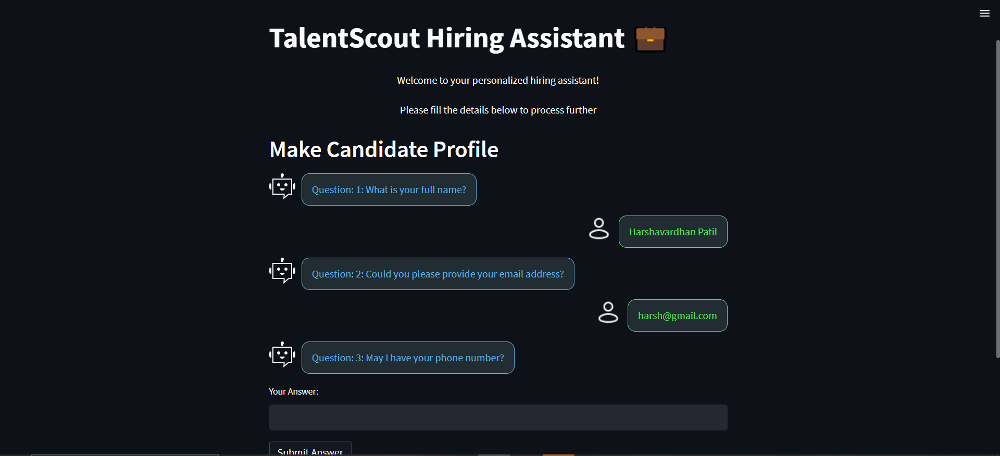
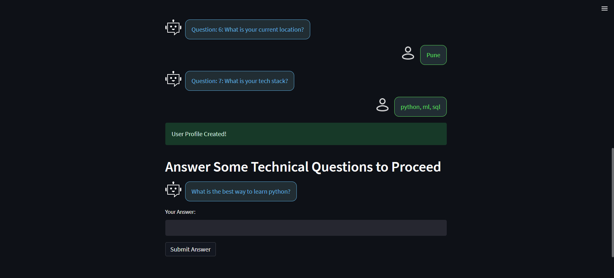
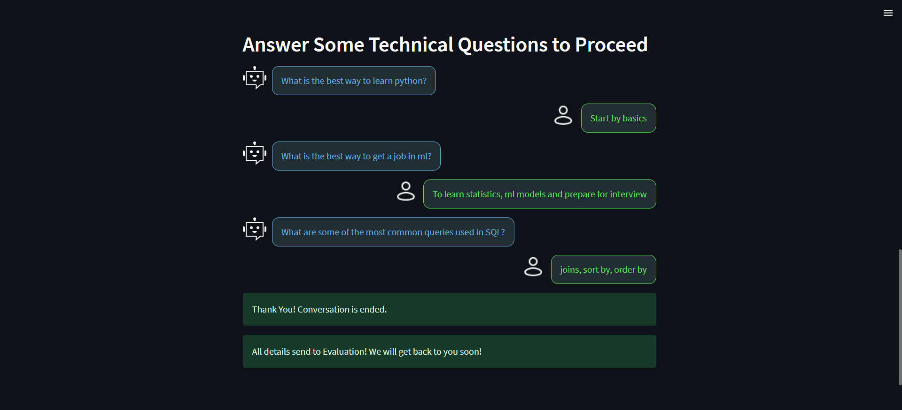

# Hiring Assistant Chatbot

### This is an interactive Streamlit application designed to streamline candidate profiling and technical interview processes. 

### The application leverages **LangChain**, **Streamlit** and **Hugging Face Hub** to dynamically generate professional questions, collect candidate profiles, and evaluate technical expertise based on their tech stack.

---

## Features
1. **Dynamic Profile Generation**  
   - Asks candidates a series of questions to create their profile.  
   - Questions include details like full name, email, phone number, experience, desired position, location, and tech stack.

2. **Technical Questioning**  
   - Generates context-aware, challenging technical questions based on the candidate's tech stack.  
   - Tracks conversation history to avoid repetition and ensures tailored question generation.

3. **Conversation Tracking**  
   - Maintains separate histories for profile generation and technical questioning.  
   - Detects conversation-ending keywords and gracefully terminates interactions.

4. **Data Persistence**  
   - Saves all candidate profiles and conversations into a JSON file for later evaluation.

## File Structure:

    ├── app.py                 

        ├── main.py  # Main Streamlit application
        ├── htmlTemplates 

    ├── assets/ # screenshot of app

    ├── candidate_conversations/  # Folder for storing candidate data

    ├── README.md              # Project documentation

    └── .env                   # Environment variables

## Installation and Setup
    1. pip install -r requirements.txt

    2. Set up the .env file with your Hugging Face API key:

        UGGINGFACEHUB_API_TOKEN=<your_hugging_face_api_token>

    4. streamlit run app.py

